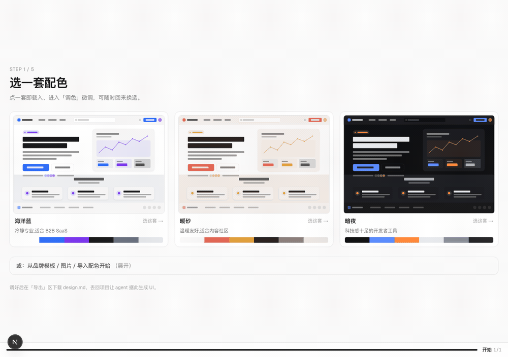

<div align="center">

# design-pact

**English** · [简体中文](README.zh.md)

[](https://www.npmjs.com/package/design-pact)
[](LICENSE)
[](https://skills.sh/no7z/design-pact)

**A design-system tool for people who build UIs with AI agents**

**[Try it live →](https://design-pact.vercel.app)**

Your agent sets direction and proposes palettes · the tool derives a whole
coherent token set deterministically · export an agent-executable `design.md`,
drop it in your repo, and let Claude Code / Cursor build UI from it.



</div>

**All AI runs on your own agent** — the agent produces the palette, the agent
generates the UI. The tool itself deterministically derives one palette into a
full, coherent token set (color / type / spacing / radius / shadow / border /
opacity / motion). No online AI, no API key. **Zero backend, no account.** The
UI is bilingual (English by default, toggle in the top-right).

---

## Quick start

**1. Install the skill** (one command; works across Claude Code / Cursor / Codex — lands in `.claude/skills/` for Claude Code)

```bash
npx skills add no7z/design-pact -g     # global: install once, available in every project
# or npx skills add no7z/design-pact   # current project only
```

**2. Trigger the skill** — type the slash command `/design-pact` in Claude Code, or just say "use the design-pact skill to build me a design system" (other agents use natural language; the skill activates from its description).

- Repo **has** a `design.md` → the agent builds UI straight from it.
- **Doesn't** → the agent clarifies direction, proposes 2–3 palettes, and opens the local studio via `npx design-pact open`.

**3. In the studio, pick a palette → fine-tune → export `design.md`** to your repo root. Back in the agent, it generates/aligns UI against that contract.

> The studio (the web app) ships in the `design-pact` package; the skill launches it on demand via `npx`, so you never install it separately.

---

## Workflow (what the studio does)

1. **Start** — load the agent's palettes, or begin from a brand template or an uploaded image.
2. **Colors** — OKLCH wheel for global harmony + per-color editing + semantic roles + light/dark pairing, with 6 live mockups and a contrast audit.
3. **Type** — two sliders (base + ratio) drive an 8-step type scale; weight / line-height / letter-spacing adjustable.
4. **Details** — spacing / radius / shadow / border / opacity, each derived from a single base slider.
5. **Motion** — a duration scale + easing curve.
6. **Export** — **design.md** (recommended, see below), plus a **visual overview** export (HTML / PNG / SVG; SVG drops straight into Figma / Illustrator). Need `tokens.css` / `tailwind.config.js` / `design-tokens.json`? Convert from design.md with the CLI (see below).

## design.md — one file, three readers

Click **Download design.md** in the export step for a self-contained markdown:

- **Humans** — prose + color/type/spacing notes, readable on GitHub or in an editor;
- **AI agents** — an embedded verbatim `:root` contract plus component→token bindings (which radius/weight/spacing step each component uses), so **your own Claude Code / Cursor reads it and builds UI to your design system**, on your compute;
- **Tools** — a W3C Design Tokens JSON block at the bottom for precise CLI conversion.

## CLI

```bash
# Convert design.md into project files (optional)
npx design-pact add design.md --format css|tailwind|w3c|all --out ./design
#   → tokens.css / tailwind.config.js / design-tokens.json

# Print a summary of the design system
npx design-pact inspect design.md

# Audit your code against the contract: find color literals outside design.md
npx design-pact check design.md src/     # exit 1 + file:line report

# Start the studio locally and open the browser
npx design-pact open
```

`check` closes the agent loop: after your agent generates UI from design.md,
it (or your CI) runs `check` to prove no off-contract colors crept in.

`css` / `w3c` are taken verbatim from design.md; `tailwind` is regenerated via the web app's own `tailwindConfig` (no drift). Fully local, deterministic, no network, no AI. See [`packages/cli`](packages/cli/README.md).

## Development

No API key required:

```bash
npm install
npm run dev
```

| Command | What it does |
|---|---|
| `npm run dev` / `build` / `start` | Standard Next.js (static export, no server routes) |
| `npm run build:studio` | Static export + bundle into the CLI package (`packages/cli/web` + `SKILL.md`) + build the CLI |
| `npm run snapshot:templates` | Re-fetch and parse brand templates → `public/templates.json` |

## Architecture at a glance

- `app/page.tsx` — single-page vertical workflow (Lenis smooth scroll), no server routes
- `lib/i18n.ts` — lightweight bilingual layer (`useTr` / `trg`, English default)
- `lib/tokens-core.ts` — framework-agnostic token types + `computedHex` + defaults (shared by web and CLI)
- `lib/store.ts` — all token state in zustand + localStorage
- `lib/scales.ts` / `lib/typography.ts` — "base → full scale" derivation
- `lib/export.ts` — text exports (incl. `design.md`); `lib/visualExport.ts` — visual exports
- `lib/templates.ts` + `public/templates.json` — brand-template snapshot (generated at build time, no GitHub dependency at runtime)
- `packages/cli` — the `design-pact` CLI (`init` / `open` / `add` / `inspect` / `check`)
- `skills/design-pact/SKILL.md` — the apply/create instructions for agents

Template data source: [VoltAgent/awesome-design-md](https://github.com/VoltAgent/awesome-design-md).

## License

[MIT](LICENSE)
