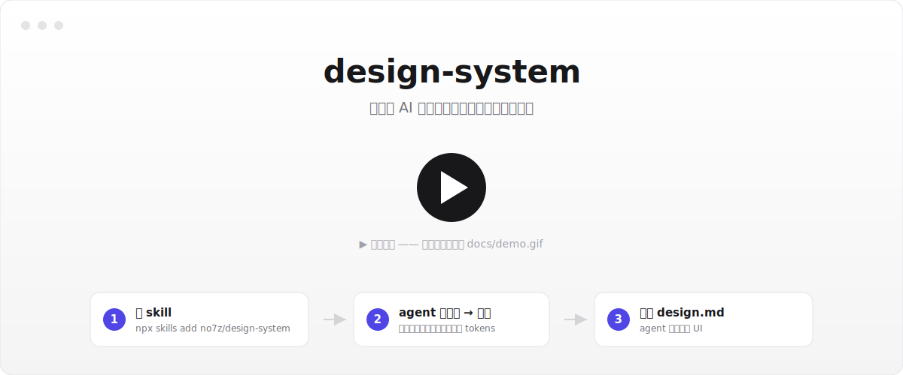

<div align="center">

# design-system

[](https://skills.sh/no7z/design-system)

**给「用 AI 生成页面的人」的设计系统工具**

你的 agent 定方向、出配色 · 工具确定性派生整套设计 tokens · 导出 AI 能逐字执行的 `design.md`,
丢进代码库让 Claude Code / Cursor 照它生成 UI。

<!-- 占位图:录一段 ~30s 演示(装 skill → 出配色 → 微调 → 导出 → 生成 UI),
     存成 docs/demo.gif,再把下面这行的 src 改成 docs/demo.gif 即可。 -->


</div>

**AI 全程跑在你自己的 agent 上** —— 配色由 agent 产出、UI 由 agent 生成。工具本身把一套配色确定性地派生成整套协调的 tokens(色板 / 字体 / 间距 / 圆角 / 阴影 / 描边 / 透明度 / 动效),不含任何在线 AI、不需要 API key。**零后端、零账户。**

---

## 快速开始

**1. 装 skill**(一条命令,跨 agent,自动装到 `.claude/skills/`)

```bash
npx skills add no7z/design-system -g     # 全局:装一次,所有项目可用
# 或 npx skills add no7z/design-system   # 只装当前项目
```

**2. 在 Claude Code / Cursor 里说**「用 design-system skill 帮我建一套设计系统」

- 项目里**有** `design.md` → agent 直接照它生成 UI。
- **没有** → agent 问清方向、给你 2–3 套配色,并用 `npx @no7z/design-system open` 在本地打开配色工具。

**3. 在网页里选一套配色 → 微调 → 导出 `design.md`**,放到项目根目录。回到 agent,它就按这份契约生成/对齐 UI。

> studio(配色网页)由 `@no7z/design-system` 包提供,skill 会在需要时自动用 `npx` 拉起,你不用单独安装。

---

## 工作流(网页里做什么)

1. **开始** — 载入 agent 产出的配色,或选品牌模板、上传图片取色开局。
2. **调色** — OKLCH 色轮整体协调 + 单色编辑 + 语义角色分配 + 明暗配对,6 种 mockup 实时预览 + 对比度审计。
3. **字体** — base + ratio 两个滑条驱动 8 级字号阶梯,字重 / 行高 / 字距可调。
4. **细节** — 间距 / 圆角 / 阴影 / 描边 / 透明度,全部「单 base 滑条派生整套阶梯」。
5. **动效** — 时长阶梯 + 缓动曲线。
6. **导出** — **design.md**(推荐)、W3C Design Tokens JSON、Tailwind 配置、CSS 变量、Figma(Tokens Studio)、视觉总览 PNG/SVG/HTML,以及**分享链接**(整套 tokens 序列化进 URL,打开即载入)。

## design.md —— 一份文件服务三类读者

导出区点「下载 **design.md**」,得到一个自包含的 markdown:

- **人** — 散文 + 色板/字体/间距说明,在 GitHub 或编辑器里直接可读;
- **AI agent** — 内嵌逐字 `:root` 契约 + 组件→token 绑定说明(按钮圆角/字重/间距各用哪档都写死),**你自己的 Claude Code / Cursor 读它就能按你的设计系统生成 UI**,用你自己的算力;
- **工具** — 文件底部的 W3C Design Tokens JSON,给配套 CLI 精确转格式。

## CLI

```bash
# 把 design.md 转成项目文件(可选)
npx @no7z/design-system add design.md --format css|tailwind|w3c|all --out ./design
#   → tokens.css / tailwind.config.js / design-tokens.json

# 打印设计系统摘要
npx @no7z/design-system inspect design.md

# 本地起配色工具并打开浏览器
npx @no7z/design-system open
```

`css` / `w3c` 逐字取自 design.md;`tailwind` 复用网页同一套 `tailwindConfig` 生成,零漂移。纯本地、确定性、不联网、不调 AI。详见 [`packages/cli`](packages/cli/README.md)。

## 开发

无需任何 API key:

```bash
npm install
npm run dev
```

| 命令 | 作用 |
|---|---|
| `npm run dev` / `build` / `start` | Next.js 常规(纯静态导出,无服务端路由) |
| `npm run build:studio` | 静态导出 + 打包进 CLI 包(`packages/cli/web` + `SKILL.md`)+ 编译 CLI |
| `npm run snapshot:templates` | 重新抓取并解析品牌模板 → `public/templates.json` |

## 架构速览

- `app/page.tsx` — 单页垂直工作流(Lenis 平滑滚动),无服务端路由
- `lib/tokens-core.ts` — 框架无关的 token 类型 + `computedHex` + 默认值(web 与 CLI 共用)
- `lib/store.ts` — zustand + localStorage 的全部 token 状态
- `lib/scales.ts` / `lib/typography.ts` — 「base → 整套阶梯」派生逻辑
- `lib/export.ts` — 文本导出(含 `design.md`);`lib/visualExport.ts` — 视觉导出
- `lib/templates.ts` + `public/templates.json` — 品牌模板快照(构建时生成,运行时不依赖 GitHub)
- `packages/cli` — `@no7z/design-system` CLI(`init` / `open` / `add` / `inspect`)
- `skills/design-system/SKILL.md` — 给 agent 的应用/创建说明

模板数据来源:[VoltAgent/awesome-design-md](https://github.com/VoltAgent/awesome-design-md)。
